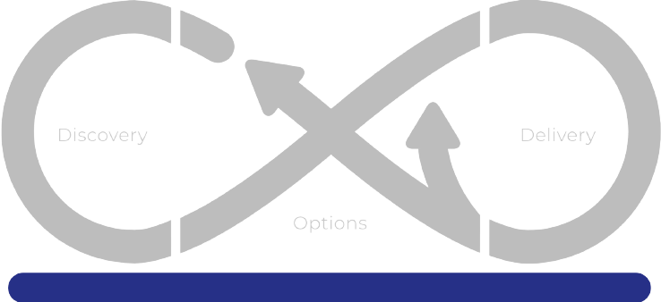

## 🌱 Brand New SRE Team!
The company sees this as an opportunity to explore Site Reliability Engineering practices and decides to form a team to provide operational excellence to PetBattle and underlying platform. But it is not just about managing apps in production. SRE practices and SRE mindset can (and will) help the company for future decisions and strategy, discover improvements for the overall system through learning from incidents, turn company into reliablity-aware by enabling others, and more. 

The company's vision for this team is that they will act like an enablement team and scale the learnings throughout the company.

[TODO] explain [Team Topologies](https://teamtopologies.com/) approach, the relationship between devs and SREs..

_Diagram credit: [Team Topologies](https://teamtopologies.com/)_

### 🦚 Forming a new team
Forming a new team is not an easy task. A team needs vision, autonomy, psychological safety and visualization of work. And we have just the right practices for that! These practices are not specific for SRE, but they are helpful to build a good foundation and culture for Site Reliability Engineering mindset to thrive. And when you have a good foundation, you can scale on top of that.

To learn more about [Open Practices](https://openpracticelibrary.com/) and how Red Hat Open Innovation Labs make a use of them, please visit https://www.redhat.com/en/services/consulting/open-innovation-labs

### Introduction to Mobius Loop
[Mobius](https://www.mobiusloop.com) is a framework that connects discovery and delivery and can be used to connect strategy to products to operations. Mobius is used to understand, align, and share measurable target outcomes so they can be tested and validated. As Red Hat Open Innovation Labs, we make use a lot of this framework.

⛷️ <b>Facilitator Note</b> ⛷️ - Split into 3-4 people group and treat each group as a separate SRE team. Each team can have their own social contract or Team API etc.

### Social Contract
- Details on [Social Contract](https://openpracticelibrary.com/practice/social-contract/) 
- An example canvas or Miro board

### Team Vision & Scope
- Introduce a space where people can put their ideas on the team's vision, who should be involved to this conversation and so on. (ie SMART framework)

### Prioritization
- Import / Effort Matrix
- Possible categories to tackle for the next 6 months
- Just Enough SRE

### Team API
- Details on [Team API](https://github.com/TeamTopologies/Team-API-template)
- An example canvas or Miro board

### Identify Metrics for Adoption
- How do you tell if it’s working well? Introduce a space to put metrics ideas during the enablement. Like an adaption scale. (ie how many apps have SLOs identified)
> https://www.usenix.org/conference/srecon15/program/presentation/lueder

### Reliability Backlog
- Introduce a backlog space. There will be stuff we need to think about, address or fix along the way.

### Empathy Maps
- (After some times) an Empathy Maps to define how SREs are seen by devs