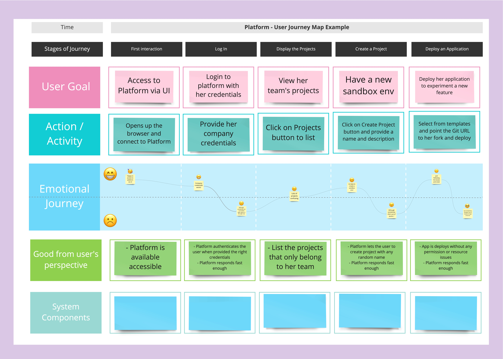
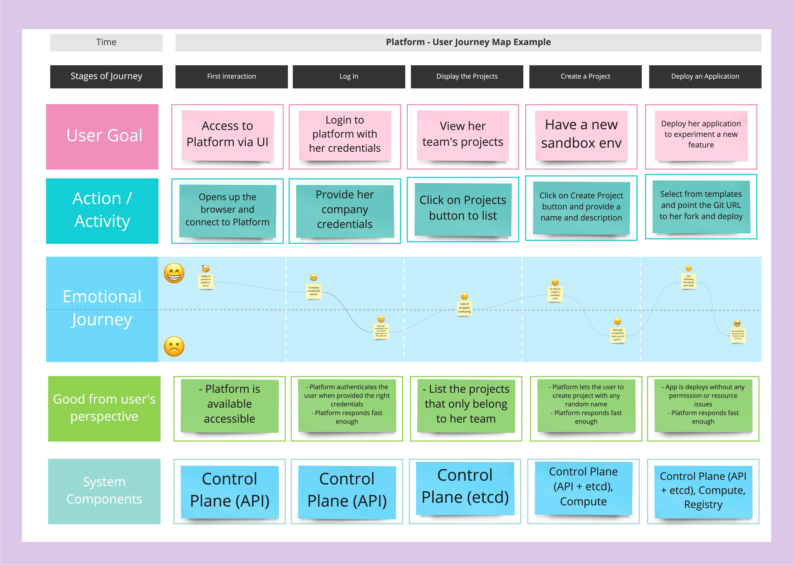
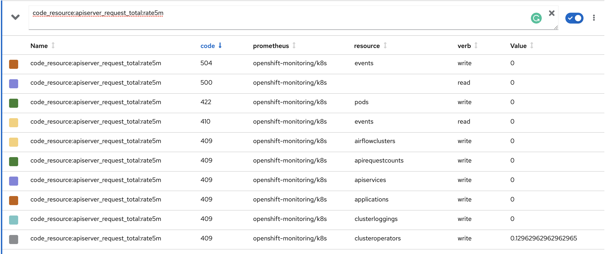

### Define Users
Platform reliability as important as the applications' and even platform is not exposed to the external customers, we have internal customers! Application developers utilize the platform
to deploy their applications, security and compliance departments consume platform for reporting and auditing, and all in all, PetBattle and other applications are running here :)

Also, platform should be treated yet another product. Therefore you should be able to decide between "new features for the platform vs. reliability". And that requires to track the reliability of the platform.

Let's start by defining the users of the Platform. Here is one example. Meet: Elaine Trakand.

### User Journey
I'm sure we can think of a lot of ways for users to interract with the platform. Let's choose "creating a sandbox environment for experimentation" as a user journey and how the user feels during this journey. 
_Note: This doesn't have to be a capability that your platform is offering_

### Map System Components
A system boundary is the point at which one or more components expose capabilities to external customers. If you think about Platform as a system, it represents the capability for users deploy their apps and serve from there. Platform has multiple internal components: Control Plane, Registry, Compute, Monitoring and so on. Let's try to map these components for this journey:

### Define SLIs for the Components
Now that we know what 'good' means for each component from user perspective at a high level, we can define SLIs for each component based on that.

Let's take Control Plane - API:
- The propotion of successful responses to API requests
- The propotion of sufficiently fast requests as measured < 200ms (a time-based measurement)
### Determine Data Points
The next step is to define where is the best place to gather data for each SLI. Make sure to look for the point closest to the end user, so that the metrics would be representative of their experience. 

OpenShift API already exposes many meaningful metrics and they are stored in Prometheus. We can leverage that and find the best metrics for us.

As a starting point, `apiserver_request_total` gives us a request response code and the number of requests, which would be a perfect candidate for "_The propotion of successful responses to API requests_" SLI definition.

#### Create a Dashboard (Optional)

#### Observe and Iterate
Observe your SLIs over a period of time (for example 1 or 2 weeks), track the correlation with user happiness, and iterate over them to get a better understanding of your service’s performance.
