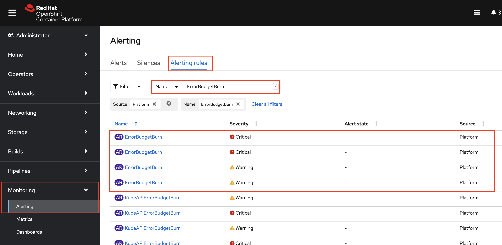

### Platform SLOs
Let's take each SLI and set a realistic objective.

```yaml
User Journey: Creating Sandbox Environments
SLI Type: Availability 
SLI Specification: The propotion of successful responses to API requests as measured from Prometheus
SLI Implementations:  
  - measured from the API metrics.  
SLO:
  99% of API requests in the past 28 days served are successfull  (ie status code is not 5xx).
```

#### Alerts on SLOs
We will use Prometheus and Alert Manager to track SLOs and get alert if we are about to burn error budgets. We will follow `Multiwindow, Multi-Burn-Rate Alerts` to generate alerts and based on its severity we either get ticket or pages. 

Let's create a `jsonnet` file to create PrometheusRules with using selected metrics:


```bash
cat << EOF >> /projects/observability/platform-prometheusrules.yaml
local slo = import 'slo-libsonnet/slo-libsonnet/slo.libsonnet';

{
  apiVersion: 'monitoring.coreos.com/v1',
  kind: 'PrometheusRule',
  metadata: {
    name: 'platform-slos',
    namespace: 'openshift-kube-apiserver',
    labels: {
      prometheus: 'platform',
      role: 'alert-rules',
    },
  },
  spec: {
    groups: [
      {
        name: 'platform.slos.rules',
        local errorburnrate = slo.errorburn({
        alertName: 'ErrorBudgetBurn',
        metric: 'apiserver_request_total',
        selectors: ['prometheus="openshift-monitoring/k8s"'],
        errorSelectors: ['code=~"5..",verb=~"GET|POST|DELETE|PATCH"'],
        target: 0.99,  // 99%
        }),
        rules:
          errorburnrate.recordingrules +
          errorburnrate.alerts,
      },
    ],
  },
}
```
It creates alerts based on the SLI (`apiserver_request_total`) and SLO (`0.99`) we have chose. 

Following commands will create the prometheus rule at `platform-prometheusrule.yaml` file.
```bash
cd /projects/tech-exercise/observability/
jb update
jsonnet -J vendor/ platform-prometheusrules.yaml | gojsontoyaml > platform-prometheusrule.yaml
```

Now let's apply the rules:
```bash
cd /projects/tech-exercise/observability/
oc apply -f platform-prometheusrule.yaml -n openshift-kube-apiserver
```

and to verify, on OpenShift UI, go to Monitoring -> Alerting -> Alerting Rules and search for 'ErrorBudgetBurn'


_and yes, OpenShift already comes with some sensible SLO definition for the platform_