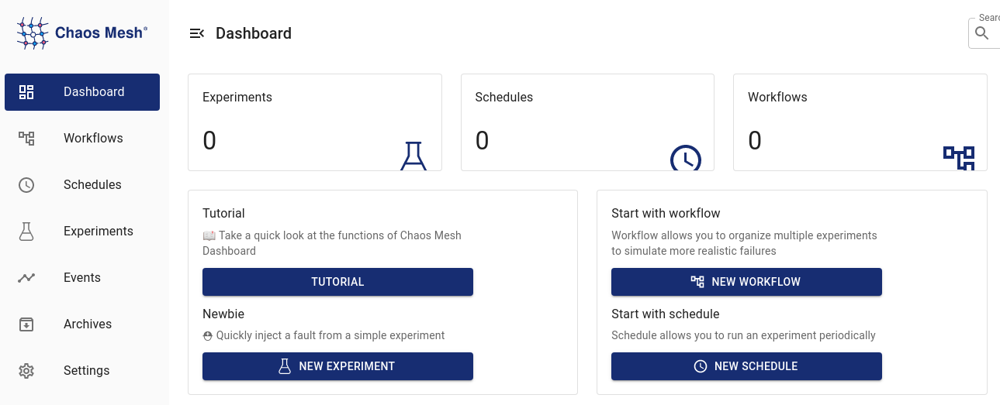

## Failure testing aka Chaos Engineering

### Install Chaos Mesh

**We could likely move this step into the cluster setup**

> As a group, do this step once per cluster. We are going to install a single Chaos mesh at cluster scope and share instance. The current version does not support multiple deployments per cluster well.

1. Let use the helm chart to install our chaos testing tooling.

    ```bash
    helm repo add chaos-mesh https://charts.chaos-mesh.org
    helm repo up
    ```

2. Create RBAC for the `ServiceAccount` that will run our chaos test suites.

    ```bash
    oc new-project chaos-testing
    oc adm policy add-scc-to-user privileged -n chaos-testing -z chaos-daemon
    ```

3. Deploy `chaos-mesh` setting `crio` options suitable for OpenShift.

    ```bash
    helm -n=chaos-testing upgrade --install chaos-mesh chaos-mesh/chaos-mesh \
    --set dashboard.create=true \
    --set chaosDaemon.runtime="crio" \
    --set chaosDaemon.socketPath="/var/run/crio/crio.sock" \
    --set clusterScoped=true \
    --set dashboard.securityMode=false
    ```

4. Expose the chaos mesh dashboard `Route`.

    ```bash
    oc -n chaos-testing expose svc chaos-dashboard --port 2333
    oc patch route/chaos-dashboard \
    --type=json -p '[{"op":"add", "path":"/spec/tls", "value":{"termination":"edge"}}]'
    ```

5. You should see the following pods running. There will be a `chaos-daemon-` pod for every worker node in your cluster, for example we have a 3 node cluster here.

    ```bash
    oc -n chaos-testing get pods -lapp.kubernetes.io/instance=chaos-mesh
    ```

    <div class="highlight" style="background: #f7f7f7">
    <pre><code class="language-bash">
    NAME                                        READY   STATUS    RESTARTS   AGE
    chaos-controller-manager-5f55678dc9-bv94h   1/1     Running   0          26h
    chaos-daemon-9kd29                          1/1     Running   0          26h
    chaos-daemon-nd7xj                          1/1     Running   0          26h
    chaos-daemon-spxjq                          1/1     Running   0          10h
    chaos-dashboard-598cd9cf6f-98fqt            1/1     Running   0          26h
    </code></pre></div>

### Logging into Chaos Mesh Dashboard

1. Retrieve the chaos mesh dashboard URL and open in a browser.

    ```bash
    echo https://$(oc -n chaos-testing get route chaos-dashboard --template='{{ .spec.host }}')
    ```

    
