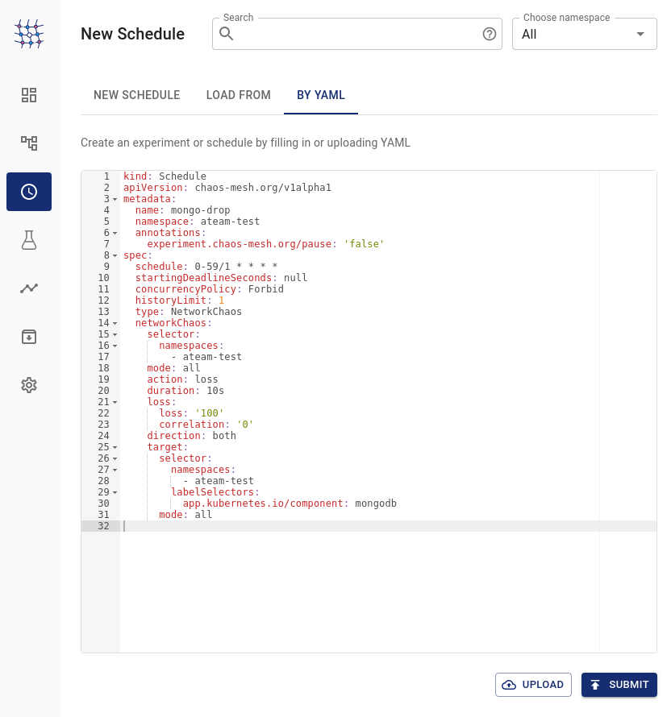
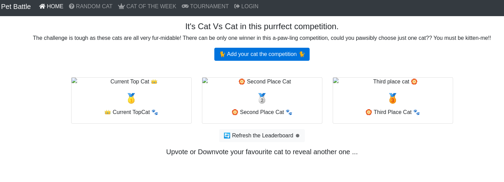

## Chaos Failure Testing

> In teams, run some chaos tests on your applications, check their responses and mitigate any failures found.

### 🧨 Network Failure

Let's setup and run a Network chaos test scenario that simulates network packet loss to the cat api mongo database. We will use the YAML import capability of chaos mesh.

1. Open a `New Schedule` and select the `By YAML` tab.

    

2. Copy and paste the following Network Chaos test definition and click `Submit`

    ```yaml
    kind: Schedule
    apiVersion: chaos-mesh.org/v1alpha1
    metadata:
      name: <TEAM_NAME>-mongo-drop
      namespace: <TEAM_NAME>-test
      annotations:
        experiment.chaos-mesh.org/pause: 'false'
    spec:
      schedule: 0-59/1 * * * *
      startingDeadlineSeconds: null
      concurrencyPolicy: Forbid
      historyLimit: 1
      type: NetworkChaos
      networkChaos:
        selector:
          namespaces:
            - <TEAM_NAME>-test
        mode: all
        action: loss
        duration: 10s
        loss:
          loss: '100'
          correlation: '0'
        direction: both
        target:
          selector:
            namespaces:
              - <TEAM_NAME>-test
            labelSelectors:
              app.kubernetes.io/component: mongodb
          mode: all
    ```

3. `Submit` all of the pieces of the Scheduled experiment i.e. the target, schedule info, and job. The experiment should start to run.

    

4. 🪄OBSERVE EXPERIMENT RUNNING :D - The experiment schedules a 10s network loss to the API database which runs every minute. Observe if the pet battle application still works OK during disruption.🪄

    If you are testing pet battle from the web page by refreshing it, during those 10 seconds, you should see a loading pause.

    

    You can also see the loss when calling the pet battle api using curl.

    ```bash
    while true; do
       echo -n `date '+%H:%M:%S'` ' ' && \
       curl -s -X 'GET' 'https://pet-battle-api-<TEAM_NAME>-test.<CLUSTER_DOMAIN>/cats/ids' -H 'accept: application/json' | jq '. | length' ; sleep 1;
    done
    ```

    <div class="highlight" style="background: #f7f7f7">
    <pre><code class="language-bash">
    10:04:55  13
    10:04:57  13
    10:04:58  13
    10:05:00  13
    <b>10:05:01  13
    10:05:16  13</b>  <== 10s drop here
    10:05:18  13
    </code></pre></div>

5. **OPTIONAL EXTRA**

    We can directly observe the packet drop by looking into how this experiment works. We need to do some detective work ! Stream and read the pod logs of the `chaos-daemon` in the `chaos-testing` projects. You should see output every minute that looks like this.

    <div class="highlight" style="background: #f7f7f7">
    <pre><code class="language-bash">
    background-process-manager	build command	{"command": "/usr/local/bin/nsexec
     -n /proc/268476/ns/net -- tc qdisc add dev eth0 parent 1:4 handle 5: netem loss 100.000000"}
    </code></pre></div>

    The chaos mesh daemon connects to the crio interface of the mongodb pod and uses a command [`nsexec`](https://github.com/chaos-mesh/nsexec) to enter the pods network namespace. It then uses the traffic control command - [`tc`](https://tldp.org/HOWTO/Traffic-Control-HOWTO/intro.html) to manipulate packet scheduler and drop (a loss of 100%) all traffic.

    If is possible to connect to the chaos damon that is running the experiment and use the `nsexec` command to display the pod's eth0 stats. For example if we designed an experiment where we set a 10% packet loss continuously, instead of an infrequent total packet loss, we get stats that look like this:

    <div class="highlight" style="background: #f7f7f7">
    <pre><code class="language-bash">
    root@chaos-daemon-9kd29:/# nsexec -n /proc/$PROC_ID/ns/net -- tc -s qdisc ls dev eth0
    qdisc netem 8002: root refcnt 2 limit 1000 loss 10%
    Sent 1073791 bytes 553 pkt (dropped 57, overlimits 0 requeues 0)
    backlog 0b 0p requeues 0
    </code></pre></div>

6. 🪄Discuss in your teams - 🪄

    - are there any modifications to the architecture you would make based on the network testing?
    - if using partial packet loss, do you see any degrading application performance? (hint: tcp retries)
    - if you set 100% loss continuously - how does the pod health checks affect the outcome?
    - how we could automate running the chaos mesh YAML test suite using tools like ArgoCD / Tekton or Jenkins Pipelines?

### 🚢 Much Much More to explore !

Chaos mesh has many more types of [tests to explore](https://chaos-mesh.org/docs/) including:

- Stress tests
- File I/O faults
- DNS faults
- Node failures
- Time faults

It also has a concept of _Workflows_. When you use Chaos Mesh to simulate real system faults, continuous validation is always a need. You might want to build a series of faults on the Chaos Mesh platform, instead of performing individual Chaos injections. Read about how to do this [here.](https://chaos-mesh.org/docs/create-chaos-mesh-workflow/)
