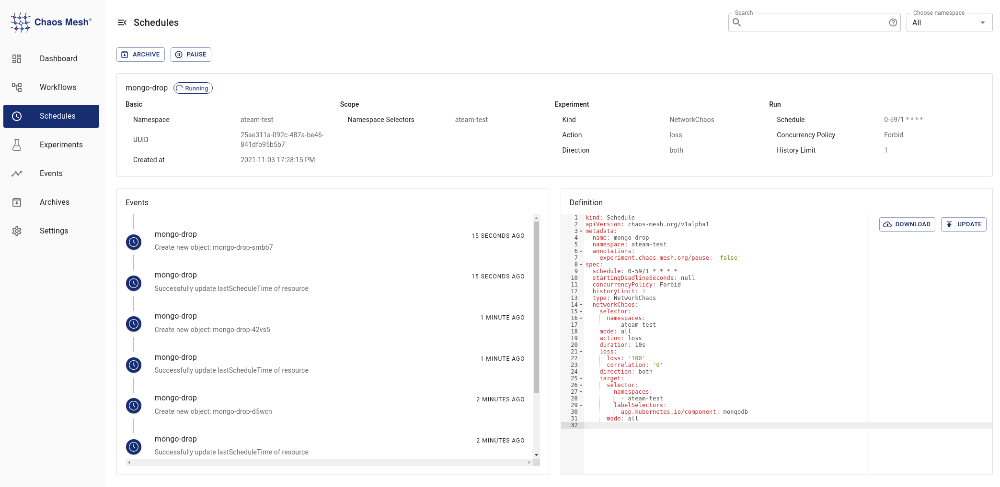

## Chaos Failure Testing

> In teams, run some chaos tests on your applications, check their responses and mitigate any failures found.

### Network Failure

setup and run a Network chaos test scenario

how do we know its working ? measure application responses

### Workflows

workflow

- automate the chaos
