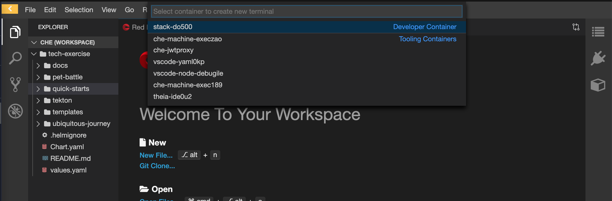

## The basics
[TODO] - update pics!!! 

## CodeReady Workspaces setup

1. Login to your CodeReadyWorkspace Editor. The link to this will be provided by your instructor.


  If the workspace has not been set up for you, you can create one from this devfile:
    - https://raw.githubusercontent.com/rht-labs/enablement-framework/main/codereadyworkspaces/do500-devfile.yaml

2. In your IDE, open a new terminal by hitting `Terminal > Open Terminal in Specific Container > do500-stack` from the menu.


<!--@Cansu - this is how you style a colour on a word mid sentence <span style="color:purple;" >zsh</span>  -->
3. <strong>OPTIONAL</strong> - if you want to use `zsh` as opposed to `sh`, you can set it as the default shell by running. `zsh` is swish and all the cool kids are using it 😎!
```bash
echo "zsh" >> ~/.bashrc
```

4. Setup your `<TEAM_NAME>` name in the environment of the CodeReadyWorkspace by replacing this and running the command below. We will use the `TEAM_NAME` variable throughout the exercises so having it stored in our session means less changing of this variable throughout the exercises 💪. Ensure your `TEAM_NAME` is spelt with lower case characters and without any spaces in the name:
```bash
echo export TEAM_NAME="<TEAM_NAME>" | tee -a ~/.bashrc -a ~/.zshrc
```

5. Retrieve the `CLUSTER_DOMAIN` from the facilitator and add it to the environment:
```bash
echo export CLUSTER_DOMAIN="<CLUSTER_DOMAIN>" | tee -a ~/.bashrc -a ~/.zshrc
```

6. Verify the variables you have set:
```bash
source ~/.bashrc
echo ${CLUSTER_DOMAIN}
echo ${TEAM_NAME}
```

7. Check if you can connect to OpenShift. The `<SERVER_API>` should be provided by your facilitator. Update it and run the command below. 
```bash
oc login --server=https://api.${SERVER_API}:6443 -u <USERNAME> -p <PASSWORD>
```

8. Check your user permissions in OpenShift by creating your team's CICD project. 
```bash
oc new-project ${TEAM_NAME}-prod
```
