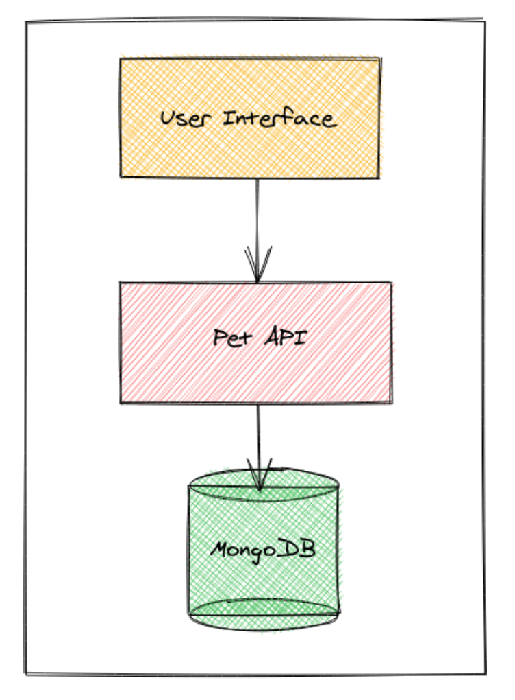
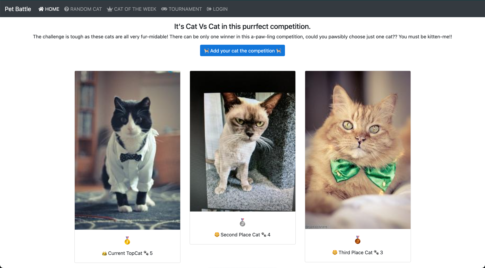

### 🐈 A Little Bit Backstory

_Bla Bla_ Inc. is an entertaiment company that creates games to make people happy! With xx number of people...

A couple of developers from the company created this fun app for their friends and families: PetBattle. They hacked around with so that the authors can `Cat versus Cat` battle each other in a simple online forum. A _My cat is better than your cat_ type of thing. There were very few bells and whistles to the initial architecture — there was a simple web-based user interface and an API layer coupled with a NoSQL database. (add footnote for book refence)

One day, they realized that their app becomes a big hit! Nearly overnight, there was a drastically increased number of players, the PetBattle server crashes, and malicious pictures of not cats start appearing on the child-friendly application. 

The company had decided to own the app and develop a business around it. Developers of the app had started an exciting journey embracing [DevOps Culture and Practices](https://rht-labs.com/tech-exercise/#/). After a couple of months, they turned this simple hobbist app into a good business. 

[TODO] Explain how devs made changes in the architecture etc...

The app is now more secure and resilient!

### 😎 All the cool kids are playing Pet Battle!
Buuuut since PetBattle became super hype, the development team started having hard times to keep up with the feature requests or bugs reports while maintaining the app on production. Incidents started to occur due to ? (high load, lack of high availability etc?) They needed to figure out things like security, scalability, operability, reliability to match with their customers and internal end users needs! (yes, there are other services depend on PetBattle now!)
